# KPM-Bridge

[](https://github.com/YassirALKarawi/kpm-bridge-open6g-ran/actions/workflows/ci.yml)
[](https://www.python.org/)
[](LICENSE)
[](REPRODUCIBILITY.md)

Reference implementation and reproducibility package for:

> **KPM-Bridge: An Uncertainty-Aware Cross-Implementation Telemetry Fabric for
> Portable AI xApps in Open 6G RAN**

[Read the current 13-page IEEE manuscript](paper/KPM-Bridge_Manuscript.pdf).

KPM-Bridge separates E2 protocol interoperability from semantic and
statistical portability. It compiles heterogeneous KPM reports into typed
canonical contracts, aligns event-time observations, corrects residual shift
from paired anchors, emits fixed-size uncertainty certificates, and supports
selective xApp inference with explicit drift invalidation.

<p align="center">
  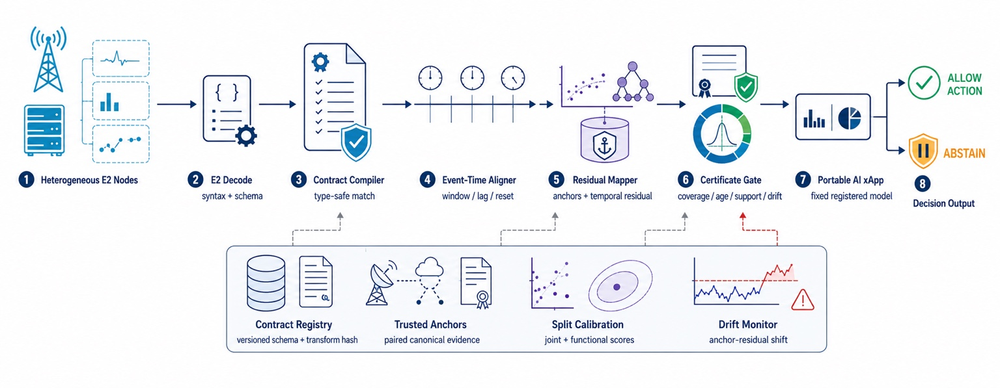
</p>

The manuscript targets the IEEE JSAC special issue **Towards Open and
Intelligent 6G RAN: Enabling Technologies and System Architectures**. The
official submission deadline is 5 August 2026.

## Evidence snapshot

- 108 hash-pinned public ColO-RAN files; 106 retained traces after the
  predeclared minimum-length rule.
- 201,912 labeled samples with independent experiment-level train/test splits.
- Eight canonical KPM features, four controlled implementation profiles,
  seven portable baselines, ablations, and five sensitivity sweeps.
- Stationary-profile mean: 0.694 NRMSE and 89.34% canonical-action agreement.
- At `alpha=0.05`: 94.32% empirical joint coverage, 54.45% acceptance, and
  0.209% conditional canonical-action disagreement.
- Under the severe P4 shift: 88.7% trace-level detection. The drift gate
  reduces post-shift joint disagreement exposure from 85.99% to 4.57%
  (94.7% relative reduction), while the conditional disagreement among the
  few admitted post-shift actions remains 76.23% and is reported explicitly.
- Fixed certificate size: 48 bytes.
- Two explicit algorithms, 18 deterministic tests, 118 fail-closed claim
  checks, and 40 DOI records verified against Crossref/DataCite.

Profiles P1--P4 are deterministic stressors applied to public traces. They are
not measurements of, or claims about, named commercial vendors.

## Repository map

```text
src/kpm_bridge/          typed contracts, mappers, certificates, xApp gate
scripts/                 data fetch, benchmark, figures, tables, audits
tests/                   deterministic unit tests
data/                    upstream policy and hash manifest (raw data ignored)
reproducibility/outputs/ claim-generating CSV and audit records
manuscript/              IEEEtran source, references, and publication figures
paper/                   Current 13-page manuscript PDF
submission/              cover letter and author submission checklist
.github/                 CI, issue forms, and dependency maintenance
```

## Quick start

```bash
git clone https://github.com/YassirALKarawi/kpm-bridge-open6g-ran.git
cd kpm-bridge-open6g-ran
python3 -m venv .venv
source .venv/bin/activate
python3 -m pip install --upgrade pip
python3 -m pip install -e '.[test]'
make test
make smoke
```

The smoke experiment is deterministic, runs without downloading the benchmark
traces, and is explicitly excluded from the paper's quantitative claims.

## Full reproduction

Python 3.11 or newer and a LaTeX distribution containing `IEEEtran`, BibTeX,
and `latexmk` are required.

```bash
python3 -m pip install -e .
make fetch       # downloads the pinned public subset; raw files stay ignored
make benchmark   # regenerates the full deterministic CSV/JSON evidence
make assets      # regenerates tables, macros, and vector result figures
make references # verifies DOI metadata through Crossref/DataCite
make paper       # builds the 13-page IEEE PDF
make audit       # runs 18 tests plus 118 fail-closed claim/submission checks
```

The complete benchmark downloads 108 hash-pinned public files and regenerates
all claim-bearing tables, CSV records, encoded certificate evidence, semantic
fail-closed checks, and result figures. See
[REPRODUCIBILITY.md](REPRODUCIBILITY.md) for the staged protocol, expected
artifacts, integrity checks, and the distinction between smoke and manuscript
evidence.

## Representative verified results

Every preview below is one of the twelve result figures in the manuscript,
rendered from the tracked audit records in
[`reproducibility/outputs/`](reproducibility/outputs/); the values are not
manually entered into the figures. The three architecture illustrations
(`fig1`–`fig3`) and full provenance for all fifteen figures are listed in the
[figure and evidence index](docs/FIGURES.md).

<table>
  <tr>
    <td width="50%" align="center">
      <a href="manuscript/figures/fig_stationary_nrmse.pdf">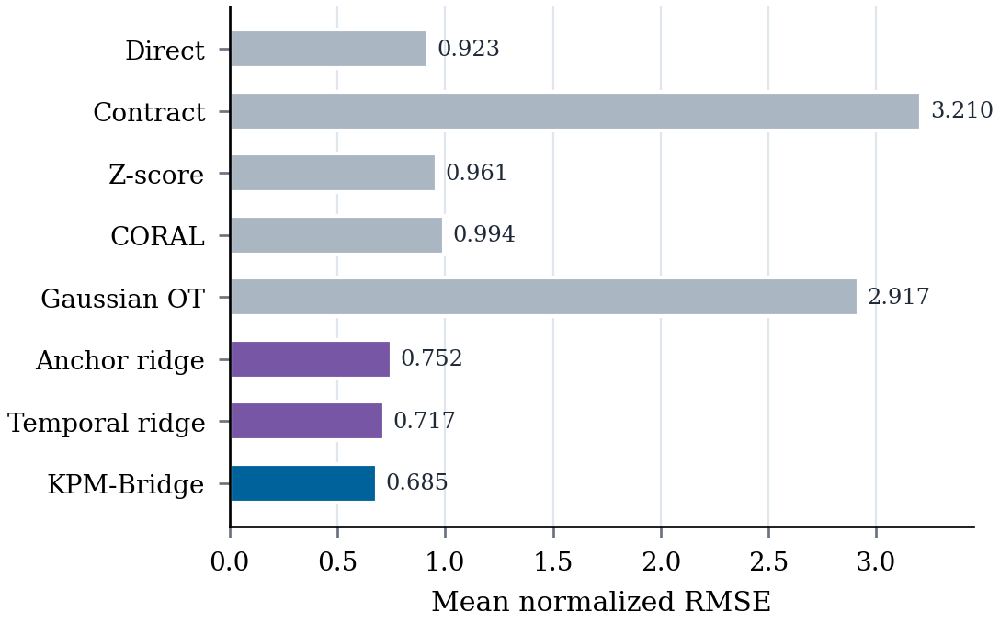</a><br>
      <b>Stationary reconstruction error</b><br>
      <sub>NRMSE across P1–P3 for all portable methods.</sub>
    </td>
    <td width="50%" align="center">
      <a href="manuscript/figures/fig_stationary_agreement.pdf">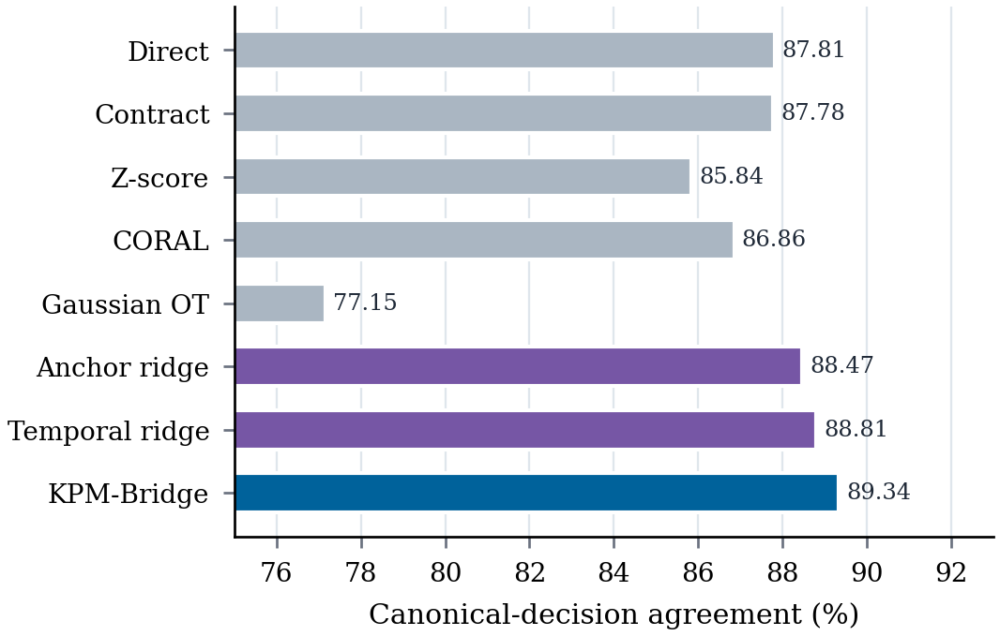</a><br>
      <b>Canonical-decision agreement</b><br>
      <sub>Fixed-xApp agreement across stationary P1–P3.</sub>
    </td>
  </tr>
  <tr>
    <td width="50%" align="center">
      <a href="manuscript/figures/fig_feature_nrmse.pdf">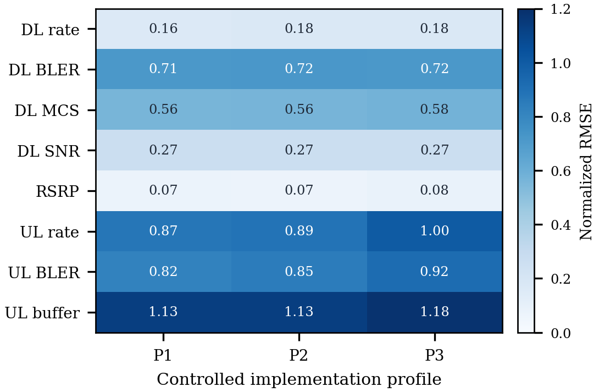</a><br>
      <b>Per-feature error structure</b><br>
      <sub>Feature-level NRMSE hidden by the pooled metric.</sub>
    </td>
    <td width="50%" align="center">
      <a href="manuscript/figures/fig_feature_gain.pdf">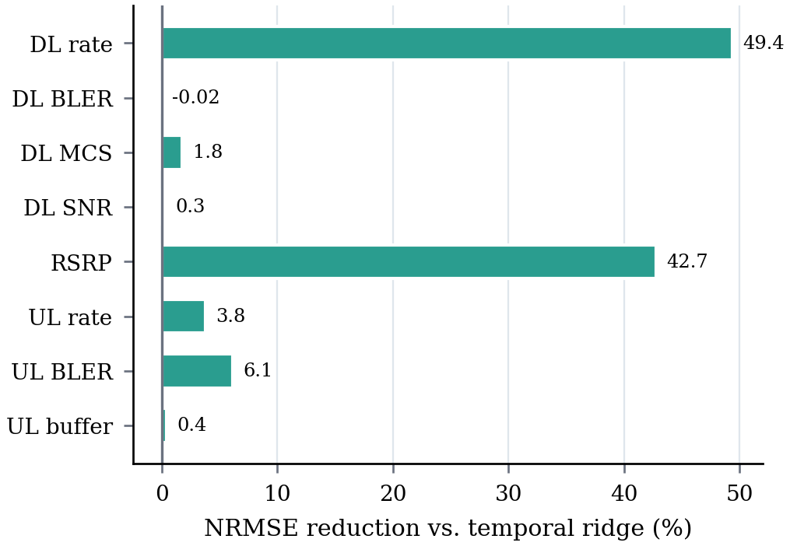</a><br>
      <b>Featurewise gain</b><br>
      <sub>NRMSE reduction relative to the temporal-ridge baseline.</sub>
    </td>
  </tr>
  <tr>
    <td width="50%" align="center">
      <a href="manuscript/figures/fig_coverage_availability.pdf">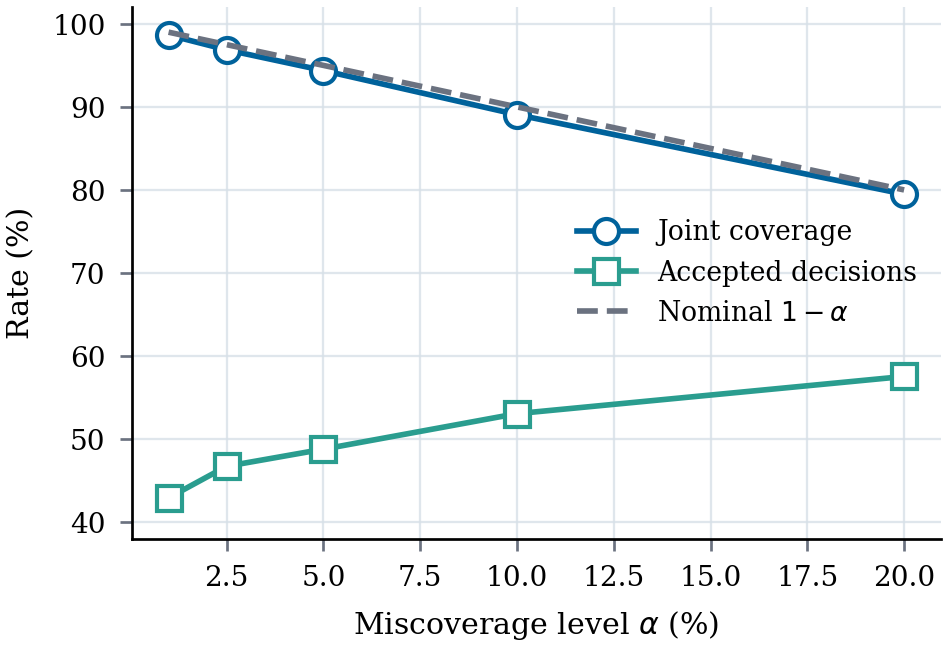</a><br>
      <b>Coverage and availability</b><br>
      <sub>Joint coverage and acceptance versus miscoverage α.</sub>
    </td>
    <td width="50%" align="center">
      <a href="manuscript/figures/fig_selective_error.pdf">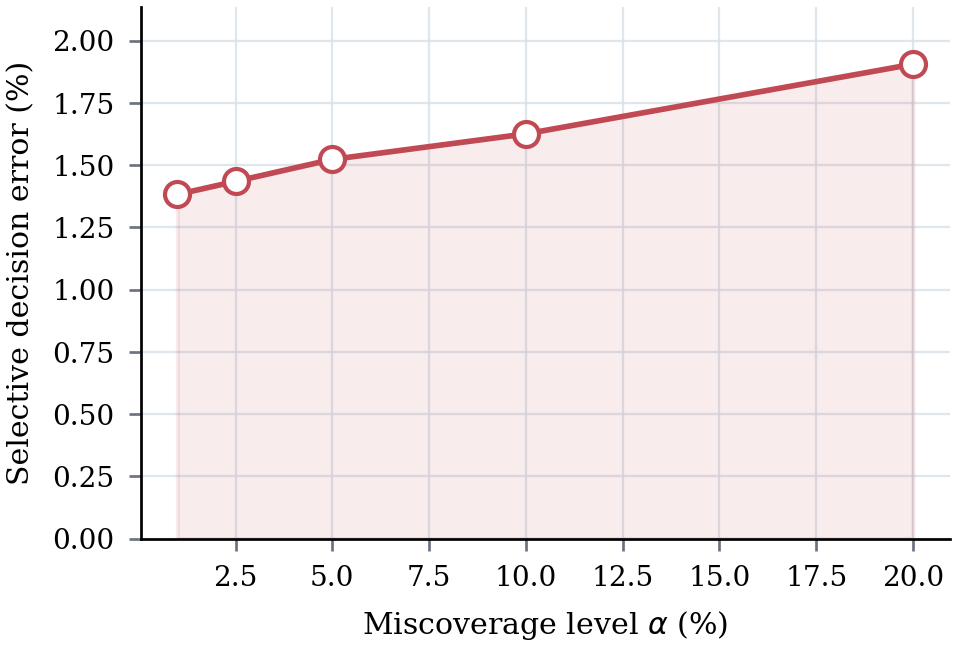</a><br>
      <b>Selective disagreement</b><br>
      <sub>Conditional canonical-action disagreement versus α.</sub>
    </td>
  </tr>
  <tr>
    <td width="50%" align="center">
      <a href="manuscript/figures/fig_drift_sensitivity.pdf">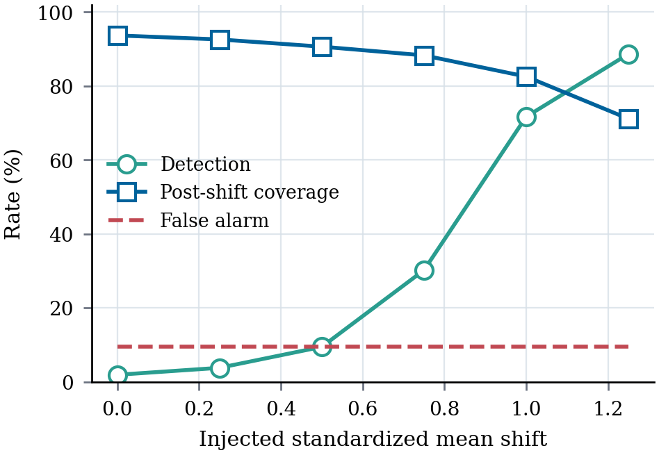</a><br>
      <b>Drift sensitivity</b><br>
      <sub>Detection, post-shift coverage, and false alarms versus shift.</sub>
    </td>
    <td width="50%" align="center">
      <a href="manuscript/figures/fig_drift_ablation.pdf">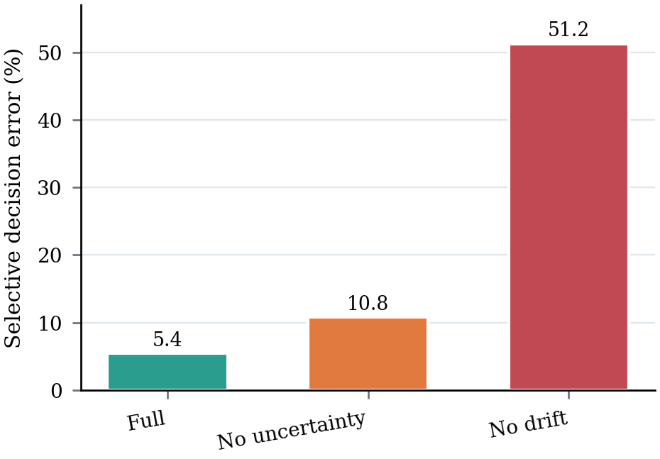</a><br>
      <b>Drift-gate ablation</b><br>
      <sub>Post-shift disagreement and joint exposure by gate variant.</sub>
    </td>
  </tr>
  <tr>
    <td width="50%" align="center">
      <a href="manuscript/figures/fig_anchor_sensitivity.pdf">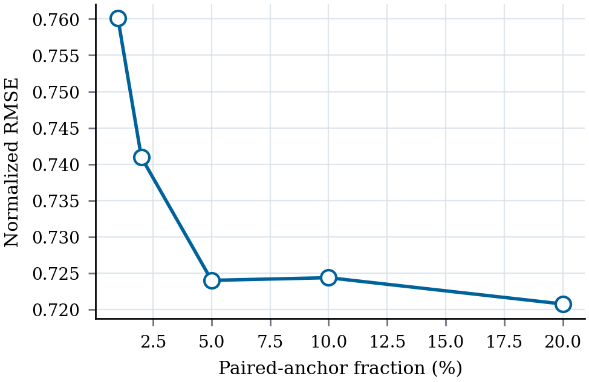</a><br>
      <b>Anchor sensitivity</b><br>
      <sub>P3 error versus the paired-anchor fraction.</sub>
    </td>
    <td width="50%" align="center">
      <a href="manuscript/figures/fig_missingness_sensitivity.pdf">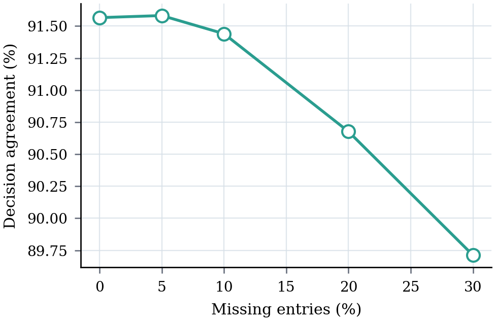</a><br>
      <b>Missingness sensitivity</b><br>
      <sub>Agreement under unseen missing-entry rates without refitting.</sub>
    </td>
  </tr>
  <tr>
    <td width="50%" align="center">
      <a href="manuscript/figures/fig_lag_sensitivity.pdf">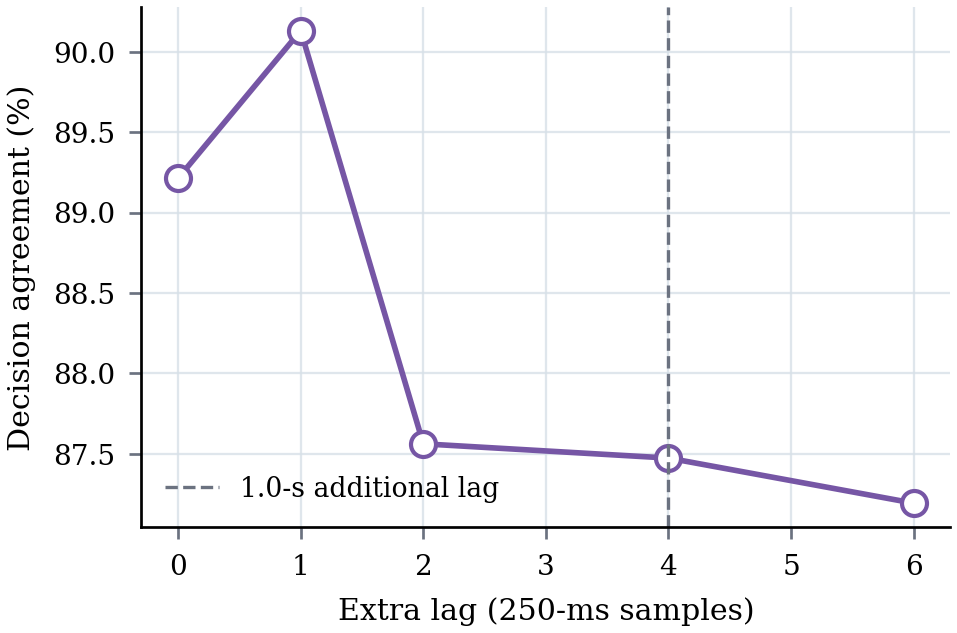</a><br>
      <b>Lag sensitivity</b><br>
      <sub>Agreement under unseen additional event-time lag.</sub>
    </td>
    <td width="50%" align="center">
      <a href="manuscript/figures/fig_runtime.pdf">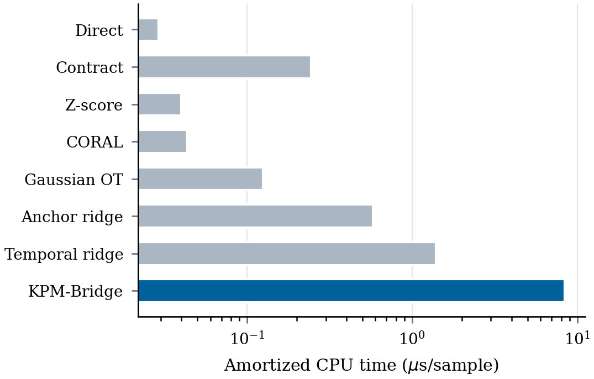</a><br>
      <b>Runtime complexity</b><br>
      <sub>Amortized per-sample inference time across baselines.</sub>
    </td>
  </tr>
</table>

## Data and licensing

The repository does not redistribute ColO-RAN traces. The downloader pins
upstream commit `bd86629d07d5fbfb778ebe3afd9d0b05e5191c6b` and verifies every
file against `data/colosseum_subset_manifest.json`. See `data/README.md` for
the upstream citation and GPL-3.0 data terms.

The original KPM-Bridge software is released under the MIT License. The
manuscript and publication figures remain copyright of the authors unless a
publisher or release record states otherwise.

## Citation

Citation metadata are provided in [`CITATION.cff`](CITATION.cff). GitHub's
**Cite this repository** control can export BibTeX or APA once the repository
is published. Until the manuscript receives a persistent publication record,
cite the software release and the accompanying manuscript title shown above.

## Contributing and security

Small, reviewable pull requests are welcome. Please read
[`CONTRIBUTING.md`](CONTRIBUTING.md) before proposing changes. Potential
security or certificate-validation vulnerabilities should be reported through
the private process in [`SECURITY.md`](SECURITY.md), not a public issue.

## Scope boundary

KPM-Bridge certifies telemetry compatibility and decision stability under the
stated assumptions. It does not prove that an xApp objective is safe,
authenticate compromised code, replace E2AP/E2SM-KPM, or solve multi-xApp
control conflicts. `SCOPE_LOCK.md` records the complete claim boundary.
